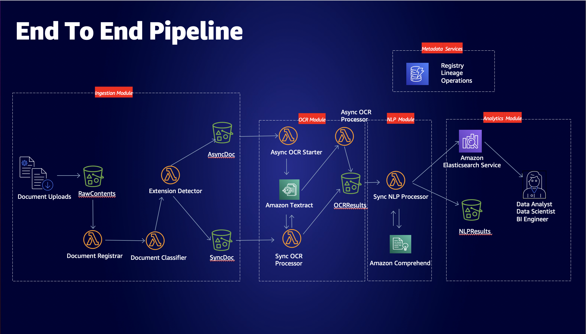
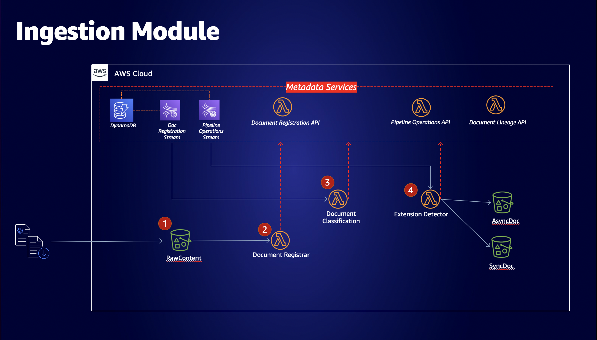
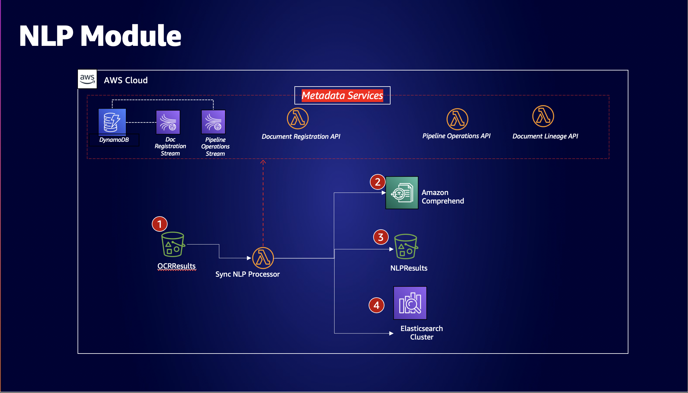
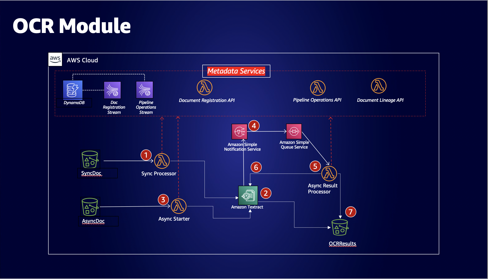
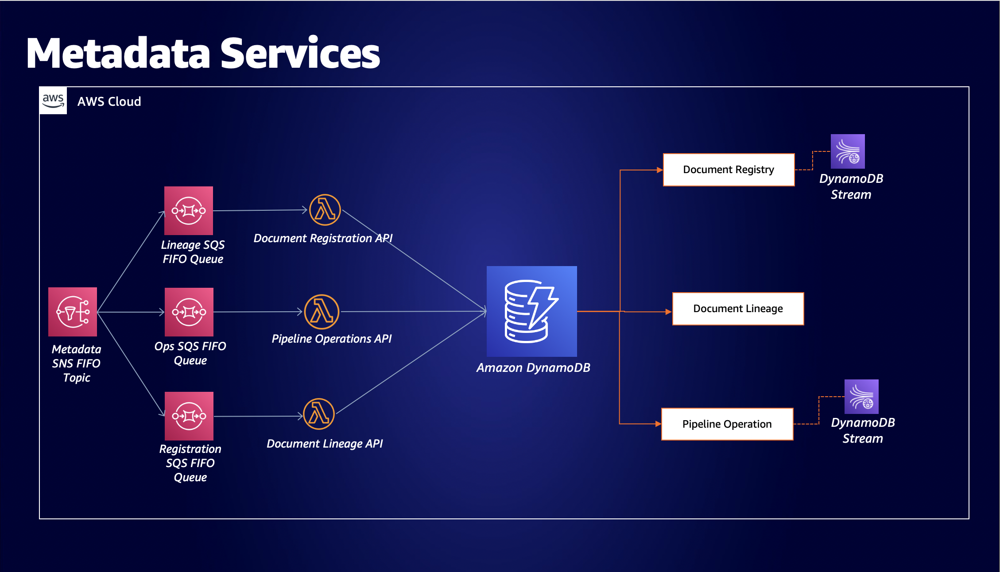

# Document Processing Pipeline For Regulated Industries (Serverless Framework + Golang)

> Credit to [David Kheyman](https://github.com/dkheyman) for the original architecture. I converted the example to use the Serverless Framework and Golang based on personal preference, but the original project which uses the CDK and Python can be viewed [here](https://github.com/aws-samples/document-processing-pipeline-for-regulated-industries)

**NOTE** We've renamed the following pieces in our project, but the slides still refer to the original architecture sample:

- Document Registrar is now Document Ingestion
- Extension Detector is now Document Processing
- Document Registration is now Document Register
- Pipeline Operations is now Document Tracking

## About

This solution implements an ML-integrated document processing pipeline using [Amazon Textract](https://aws.amazon.com/textract), [Amazon Comprehend](https://aws.amazon.com/comprehend), [Amazon Elasticsearch Service](https://aws.amazon.com/elasticsearch-service), and [Amazon S3](https://aws.amazon.com/s3), with a surrounding document governance and lineage service, developed with [Amazon DynamoDB](https://aws.amazon.com/dynamodb), [Amazon SNS](https://aws.amazon.com/sns), [Amazon SQS](https://aws.amazon.com/sqs), and [AWS Lambda](https://aws.amazon.com/lambda/).

## Use Case

Customers in regulated industries want to use machine learning services to automate, annotate, and enhance their static document processing capabilities. However, there are strong compliance and data governance concerns in the field.

This solution is an end to end example of how customers can architect their solutions using asynchronous metadata services, that tie together steps of document processing pipelines, and their outputs, to the original document, thus creating a governance model centered around data lineage, data governance, and documented recordings of uploaded documents.

## Architecture

### Whole Pipeline: Figure 1

### Ingestion Module: Figure 2

### NLP Module: Figure 3

### OCR Module: Figure 4

### Metadata Services Module: Figure 5


## Requirements

- A Linux or MacOS-compatible machine or subsystem.
- An AWS account with sufficient permissions

## Environment Setup

1. Install WSL2 by following the instructions [here](documentation/Installing%20WSL2%20%20(Windows%2010%20%26%2011).md)

## Developing With Go (NEEDS WORK)

Go [here](https://pkg.go.dev) to find helpful packages and libraries.

After adding a new reference execute the following where the *go.mod* file is located: `go mod tidy`

Test convention must have the suffix convention: `*_test.go`.  Execute with `go test`

Build your project with `go build`

More learning material [here](https://go.dev/doc/modules/developing)

## Project Structure

```bash
- documentation # Setup documentation
- src # Source code
    - awshelper # go package for aws helper utilities
    - datastores # go package for dynamo data layer classes
    - lambda # contains all deployable go lambdas
        - comprehend_processor # go lambda triggered off Textract S3 to process textract results with Comprehend + send to Opensearch.
        - document_classifier # metadata go lambda triggered off registration DB stream to check if document is valid + trigger events accordingly.
        - document_ingest # go lambda triggered off uploaded documents in RawDocuments S3.  Beginning of the workflow.
        - document_lineage # metadata go lambda to track document history in the system in relation to posted lineage events.
        - document_processor # go lambda triggered off valid classified documents in tracking DB stream to assess the document type + place it in the appropriate bucket (sync or async)
        - document_register # metadata go lambda triggered off ingestion events that tag + catalogue the document then sends events for further processing.
        - document_tracking # metadata go lambda to track record processing in the system in relation to posted pipeline events.  
        - textract_async_processor # go lambda that is triggered off textract completion SNS, processes the result and writes to S3
        - textract_async_starter # go lambda triggered off async bucket and initiates textract async processing (PDF).
        - textract_sync_processor # go lambda triggered off sync bucket, does textract sync processing (JPG, PNG) and writes to S3.
    - metadata # go package for metadata clients used to push events for downstream consumers.
    - textractparser # go package for textract parsing + writing to S3
- cf-template.resources.yml # Cloudformation resource definitions (S3, SNS, DynamoDB, ElasticSearch, etc.)
- go.mod # Go module file
- go.sum # Go dependencies
- Makefile # Build file to streamline build operation.
- package.json # Serverless dependencies
- serverless.yml # Project definition + structure + infrastructure as code.
```

## Build and Deploy

- Setup your local AWS credentials with aws configure --profile *profilename* for the *Deploy* step.
- Edit the *Makefile* and replace the profile name with the one you created.

```sh
make deploy
```

## Cleanup Resources

- Edit the *Makefile* and replace the profile name with the one you created for the *Remove* step.
Delete the stack by executing the following

```sh
make remove
```

## Testing

In order to test the pipeline, and witness some results, do the following:

1. In the [Amazon S3 console](https://s3.console.aws.amazon.com/s3/), locate the S3 bucket whose name is `document-processing-pipeline-dev-rawdocumentsbucket...`. This is the initial upload bucket that kickstarts the whole process.
1. Upload your favorite PDF to it (one that is preferably not too long).
1. Once the upload succeeds, go ahead and open the [DynamoDB console](https://console.aws.amazon.com/dynamodbv2/) and look at the `document-processing-pipeline-dev-document-registry`, which is our Registry that defines the documents uploaded and their owners. The document you just uploaded should be referenced here by a unique `documentId` primary key.
1. Next, look at the `document-processing-pipeline-dev-document-lineage` that provides the Lineage for the top-level objects, and their paths, created from the document you just uploaded; these are all directly referencing the original document via the `documentId` identifier. Each also has a unique `documentSignature` that identifies that unique object in the S3 space.
1. Further, look at the `document-processing-pipeline-dev-pipeline-operations` that provides a traceable timeline for each action of the pipeline, as the document is processed through it.
1. In this implementation, the last step of the pipeline is dictated by the `SyncComprehend` NLP Module; that will be reflected in the `Stage` in the Pipeline Operations table. Once that reads `SUCCEEDED`, your document has:
   1. Been analyzed by both Textract and Comprehend
   1. Had both analyses and their outputs poured into each respective S3 bucket (`textractresults`, and `comprehendresults`) following a naming convention.
   1. Had a complete NLP and OCR payload sent to Amazon Elasticsearch.
1. In the `textractresults` S3 bucket, there is a structure put in place for collecting Textract results:
```s3://<textract results bucket>/<document ID>/<original uploaded file path>/ocr-analysis/page-<number>/<Textract output files in JSON, CSV, and TXT formats>```
If you want to take a look at the original Textract output for the whole document, that file is called `fullresponse.json` found where the page sub-folders are.
1. In the `comprehendresults` S3 bucket, there is also a structure put in place for collecting Comprehend results; this is simply:
```s3://<comprehend results bucket>/<document ID>/<original uploaded file path>/comprehend-output.json```
1. Navigate to the [Elasticsearch console](https://console.aws.amazon.com/es/) and access the Kibana endpoint for that cluster.
1. There should be searchable metadata, and contents of the document you just analyzed, available under the `document` index name in the Kibana user interface. The structure of that JSON metadata should look like this:

```json
{
        'documentId': "asdrfwffg-1234560",  # a unique string UUID generated by the pipeline
        'page'      : 1,  # corresponds to the document page number                           
        'KeyPhrases': [],  # list of key phrases on that page, identified by Comprehend     
        'Entities'  : [], # a list of entities on that page, identified by Comprehend   
        'text'      : "lorem ipsum",  # string raw text on that page, identified by Textract
        'table'     : "Column 1, Column 2...", # string of CSV-formatted tables (if any) on that page, identified by Textract
        'forms'     : ""  # string of forms data (if any) on that page, identified by Textract
}
```

:exclamation::exclamation: By default, only AWS resources in the account can access the Elasticsearch HTTPS endpoint. Make sure to edit the Access Policy to allow for, e.g. your `SourceIP` address.  This can be done in the cloudformation itself or in the console. A detailed explanation of controlling Kibana access can be found [here](https://docs.aws.amazon.com/elasticsearch-service/latest/developerguide/es-ac.html).

Sample Policy:

```json
    {
      "Version": "2012-10-17",
      "Statement": [
        {
          "Effect": "Allow",
          "Principal": {
            "AWS": "*"
          },
          "Action": [
            "es:ESHttp*"
          ],
          "Condition": {
            "IpAddress": {
              "aws:SourceIp": [
                "X.Y.Z.1"  //Replace with your IP here.
              ]
            }
          },
          "Resource": "arn:aws:es:us-east-1:${aws:accountId}:domain/keyphrasedomain-dev/*"
        }
      ]
    }
```

## Extending this Solution

This solution was written to purposely make it easy and straightforward to extend. For example, to add a new pipeline step, all it requires is a Lambda, an invocation trigger, integrating with the metadata services clients (and lineage client if needed), adding some IAM permissions, and naming the pipeline step!

### Data Lake Applications

Data lakes are perfect way to extend this solution; simply plug in the `DocumentRegistry` lambda function to be triggered by any number of S3 buckets, and now the solution will be able to handle any document placed into the lake. The solution does also support versioned buckets for lineage and registration.

Because document registration is **fundamentally decoupled** from document analysis in our ingestion module, you can easily customize which documents in your data lake are sent downstream by configuring the `DocumentClassifier` lambda using business logic to determine, e.g. the class of the document, or given the source bucket, whether this would classify as a reason to analyze or simply just a registration.

### Using other ML products for NLP and OCR

The NLP and OCR tooling itself can be replaced quite easily; the solution provides a pattern for **both** asynchronous and synchronous paths. Some AWS customers might decide to replace Textract or Comprehend with an in-house or 3rd party solution. In that case, the Lambda functions issuing those calls to the OCR or NLP APIs would change, but everything else in the solution should remain very similar.

### Downstream Analytics

The analytics portion of the pipeline just consists of an Elasticsearch cluster for ad-hoc querying. But customers can easily extend the pipeline to add on more data destinations, depending on various use cases. For example, if a customer wants to take the `Table` data produced by Textract, and shuffle it off into a relational database for structured querying and analysis, that could be made possible by creating S3 event triggers for uploads of `tables.csv` objects in the `textractresults` bucket. This method would use the same metadata clients, to deliver events for the lineage and pipeline operations metadata tables, and integrate seamlessly with the rest of the workflow.

### Metadata Services Applications

The metadata services SNS topic provides an asynchronous mechanism for downstream applications or users to receive updates on pipeline progress. For example, if a customer wants to know when their document will be finished, an application user interface can develop an endpoint that subscribes to the SNS topic, looking for `SUCCEEDED` statuses in the message body. If that is received, then the UI can update the document to reflect that.

By the same token, the metadata services can be used to determine unauthorized processing on documents that are not safe to be run through the pipeline for regulatory reasons. The `DocumentClassifier` is precisely the place to flag and halt such cases; if a document is denied, a client message could be sent to the SNS topic determining the reasons, and security teams could take appropriate measures.

## Notes and Todos

- Write tests
- Maybe look into writing tests and submitting the textract parser for go [here](https://github.com/aws-samples/amazon-textract-response-parser) after tests are written.

## License

This project is licensed under the Apache-2.0 License.
