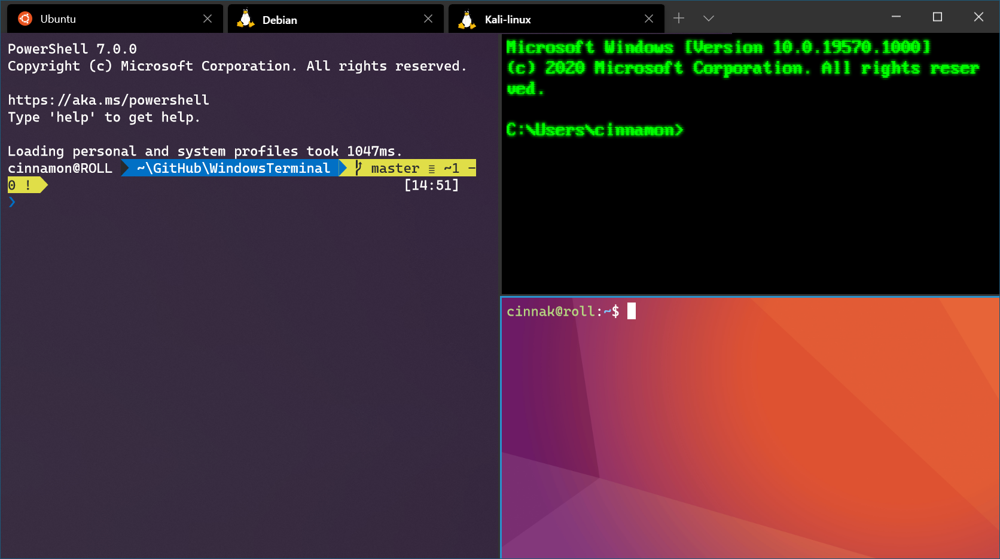

# **Installing WSL2 (Windows 10 & 11)**

*This page will guide you through the process of installing the necessary tools for building and debugging Containers: the Windows Subsystem for Linux (WSL2), and a Linux distribution inside of WSL (Ubuntu)*

> For up-to-date instructions, please refer to the [Microsoft official documentation](https://learn.microsoft.com/en-us/windows/wsl/setup/environment#set-up-your-linux-username-and-password).

## **Get started**

Windows Subsystem for Linux comes with the Windows operating system, but you must enable it and install a Linux distribution before you can begin using it.

To use the simplified --install command, you must be running a recent build of Windows (Build 20262+). To check your version and build number, select **Windows logo key + R**, type **winver**, select **OK**. You can update using the [Settings menu](ms-settings:windowsupdate) or [Windows Update Assistant](https://www.microsoft.com/software-download/).

If you prefer to install a Linux distribution other than Ubuntu, or would prefer to complete these steps manually, see the [WSL installation page](https://learn.microsoft.com/en-us/windows/wsl/install) for more details.

Open PowerShell (or Windows Command Prompt) and enter:

```powershell
wsl --install
```

The --install command performs the following actions:

- Enables the optional WSL and Virtual Machine Platform components
- Downloads and installs the latest Linux kernel
- Sets WSL 2 as the default
- Downloads and installs the Ubuntu Linux distribution (reboot may be required)

You will need to restart your machine during this installation process.


Check the [troubleshooting installation](https://learn.microsoft.com/en-us/windows/wsl/troubleshooting) article if you run into any issues.

## **Set up your Linux username and password**

Once the process of installing your Linux distribution with WSL is complete, open the distribution (Ubuntu by default) using the Start menu. You will be asked to create a **User Name** and **Password** for your Linux distribution.

- This **User Name** and **Password** is specific to each separate Linux distribution that you install and has no bearing on your Windows user name.

- Please note that whilst entering the **Password**, nothing will appear on screen. This is called blind typing. You won't see what you are typing, this is completely normal.

- Once you create a **User Name** and **Password**, the account will be your default user for the distribution and automatically sign-in on launch.

- This account will be considered the Linux administrator, with the ability to run `sudo` (Super User Do) administrative commands.

- Each Linux distribution running on WSL has its own Linux user accounts and passwords.  You will have to configure a Linux user account every time you add a distribution, reinstall, or reset.

> [!NOTE]
> Linux distributions installed with WSL are a per-user installation and can't be shared with other Windows user accounts. Encountering a username error? [StackExchange: What characters should I use or not use in usernames on Linux?](https://serverfault.com/questions/73084/what-characters-should-i-use-or-not-use-in-usernames-on-linux)


To change or reset your password, open the Linux distribution and enter the command: `passwd`. You will be asked to enter your current password, then asked to enter your new password, and then to confirm your new password.

If you forgot the password for your Linux distribution:

1. Open PowerShell and enter the root of your default WSL distribution using the command: `wsl -u root`

    > If you need to update the forgotten password on a distribution that is not your default, use the command: `wsl -d Debian -u root`, replacing `Debian` with the name of your targeted distribution.

2. Once your WSL distribution has been opened at the root level inside PowerShell, you can use this command to update your password: `passwd <username>` where `<username>` is the username of the account in the distribution whose password you've forgotten.

3. You will be prompted to enter a new UNIX password and then confirm that password. Once you're told that the password has updated successfully, close WSL inside of PowerShell using the command: `exit`.

## **Update and upgrade packages**

We recommend that you regularly update and upgrade your packages using the preferred package manager for the distribution. For Ubuntu or Debian, use the command:

```bash
sudo apt update && sudo apt upgrade
```

Windows does not automatically update or upgrade your Linux distribution(s). This is a task that most Linux users prefer to control themselves.

### **Cool additional tools for WSL**

```bash
apt-get install apt-transport-https ca-certificates gnupg curl lsb-release mc vim unzip zip jq git openssl
sudo wget -qO /usr/bin/yq https://github.com/mikefarah/yq/releases/latest/download/yq_linux_amd64 && sudo chmod 0755 /usr/bin/yq
```

## **Set up Windows Terminal**

Windows Terminal can run any application with a command line interface. Its main features include multiple tabs, panes, Unicode and UTF-8 character support, a GPU accelerated text rendering engine, and the ability to create your own themes and customize text, colors, backgrounds, and shortcuts.

Whenever a new WSL Linux distribution is installed, a new instance will be created for it inside the Windows Terminal that can be customized to your preferences.

We recommend using WSL with Windows Terminal, especially if you plan to work with multiple command lines. See the Windows Terminal docs for help with setting it up and customizing your preferences, including:

- [Install Windows Terminal or Windows Terminal (Preview)](/windows/terminal/get-started) from the Microsoft Store
- [Use the Command Palette](/windows/terminal/get-started#invoke-the-command-palette)
- Set up [custom actions](/windows/terminal/#custom-actions) like keyboard shortcuts to make the terminal feel natural to your preferences
- Set up the [default startup profile](/windows/terminal/customize-settings/startup)
- Customize the appearance: [theme](/windows/terminal/customize-settings/appearance#theme), [color schemes](/windows/terminal/customize-settings/color-schemes), [name and starting directory](/windows/terminal/customize-settings/profile-general), [background image](/windows/terminal/customize-settings/profile-appearance#background-image), etc.
- Learn how to use [command line arguments](/windows/terminal/command-line-arguments?tabs=windows) like opening a terminal with multiple command lines split into window panes or tabs
- Learn about the [search feature](/windows/terminal/search)
- Find [tips and tricks](/windows/terminal/tips-and-tricks), like how to rename or color a tab, use mouse interactions, or enable "Quake mode"
- Find tutorials on how to set up [a customized command prompt](/windows/terminal/tutorials/custom-prompt-setup), [SSH profiles](/windows/terminal/tutorials/ssh), or [tab titles](/windows/terminal/tutorials/tab-title)
- Find a [custom terminal gallery](/windows/terminal/custom-terminal-gallery/custom-schemes) and a [troubleshooting guide](/windows/terminal/troubleshooting)



## **File storage**

- To open your WSL project in Windows File Explorer, enter: `explorer.exe .` <br> *Be sure to add the period at the end of the command to open the current directory.*

- [Store your project files on the same operating system as the tools you plan to use](https://learn.microsoft.com/en-us/windows/wsl/filesystems#file-storage-and-performance-across-file-systems). <br>For the fastest performance speed, store your files in the WSL file system if you are working on them with Linux tools in a Linux command line (Ubuntu, OpenSUSE, etc). If you're working in a Windows command line (PowerShell, Command Prompt) with Windows tools, store your files in the Windows file system. Files can be accessed across the operating systems, but it may significantly slow down performance.

For example, when storing your WSL project files:

- Use the Linux file system root directory: `\\wsl$\<DistroName>\home\<UserName>\Project`
- Not the Windows file system root directory: `C:\Users\<UserName>\Project` or `/mnt/c/Users/<UserName>/Project$`


## **Set up version management with Git**

Git comes already installed with most of the Windows Subsystem for Linux distributions, however, you may want to update to the latest version. You also will need to set up your git config file.

To install Git, see the [Git Download for Linux](https://git-scm.com/download/linux) site. Each Linux distribution has their own package manager and install command.

For the latest stable Git version in Ubuntu/Debian, enter the command:

```bash
sudo apt-get install git
```

> [!NOTE]
> You also may want to [install Git for Windows](https://git-scm.com/download/win) if you haven't already.

### **Git config file setup**

To set up your Git config file, open a command line for the distribution you're working in and set your name with this command (replacing "Your Name" with your preferred username):

```bash
git config --global user.name "Your Name"
```

Set your email with this command (replacing "youremail@domain.com" with the email you prefer):

```bash
git config --global user.email "youremail@domain.com"
```

### **Git with SSH**

A simple way to use Git in the WSL is via SSH. If you'd rather setup with the windows credential manager, instructions can be found [here](https://learn.microsoft.com/en-us/windows/wsl/tutorials/wsl-git)

- [Azure DevOps SSH](https://learn.microsoft.com/en-us/azure/devops/repos/git/use-ssh-keys-to-authenticate?view=azure-devops)
- [GitHub SSH](https://help.github.com/en/articles/connecting-to-github-with-ssh)
- [Bitbucket SSH](https://confluence.atlassian.com/bitbucket/ssh-keys-935365775.html)

### **Git line endings**

If you are working with the same repository folder between Windows, WSL, or a container, be sure to set up consistent line endings.

Since Windows and Linux use different default line endings, Git may report a large number of modified files that have no differences aside from their line endings. To prevent this from happening, you can disable line ending conversion using a `.gitattributes` file or globally on the Windows side. See this [VS Code doc about resolving Git line ending issues](https://code.visualstudio.com/docs/remote/troubleshooting#_resolving-git-line-ending-issues-in-containers-resulting-in-many-modified-files).

## **Install NodeJS**

1. Open a terminal and run the following command: `curl -o- https://raw.githubusercontent.com/nvm-sh/nvm/master/install.sh | bash`
1. Close your terminal and reopen it.  Executing the command: `command -v nvm` should return *nvm*
1. Install Node LTS with the following command: `nvm install --lts` and verify the installation took with the following command: `node --version`
1. Multiple versions of Node can be installed and switched by using the `nvm use <versionname>` command.

## Install Serverless Framework

Execute the following command to have Serverless installed: `npm install -g serverless`

## Install Go

- Install Golang by following the instructions [here](https://go.dev/doc/install)

## **Additional resources**

- [WSL Documentation](https://learn.microsoft.com/en-us/windows/wsl/): Overview of WSL with related links.
- [WSL Environment Setup](https://learn.microsoft.com/en-us/windows/wsl/setup/environment): More comprehensive setup instructions and examples.
- [Set up your development environment on Windows](https://learn.microsoft.com/en-us/windows/dev-environment/): Learn more about setting up your development environment for your preferred language or framework, such as React, Python, NodeJS, Vue, etc.
- [Troubleshooting](https://learn.microsoft.com/en-us/windows/wsl/troubleshooting): Find common issues, where to report bugs, where to request new features, and how to contribute to the docs.
- [FAQs](https://learn.microsoft.com/en-us/windows/wsl/faq): Find a list of frequently asked questions.